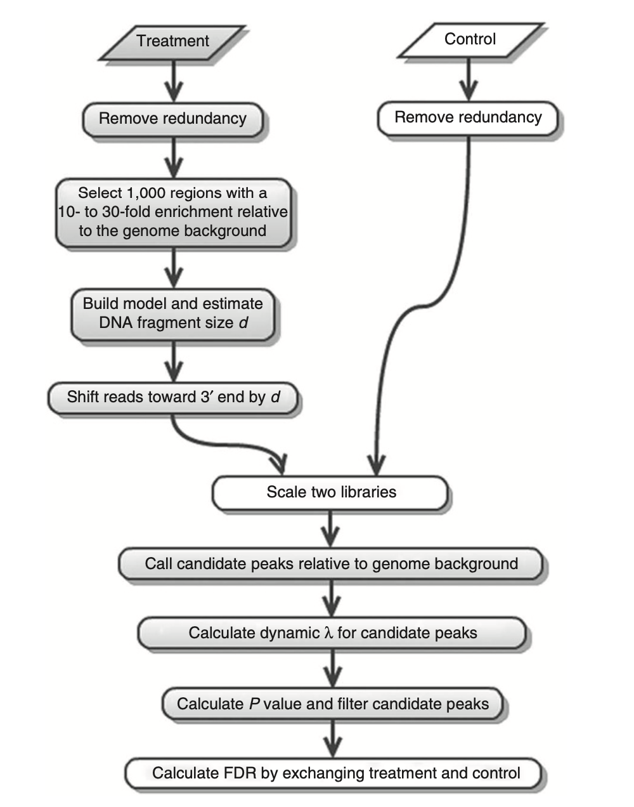

.. _backbone-label:

macs2
==============================
Model-based analysis of ChIP-seq (MACS) is a computational algorithm that identifies genome-wide locations of transcription/chromatin factor binding or histone modification from ChIP-seq data. MACS consists of four steps: removing redundant reads, adjusting read position, calculating peak enrichment and estimating the empirical false discovery rate (FDR). 

ChIP comprises a few basic steps: cross-linking a protein to chromatin, shearing the chromatin, using a specific antibody to precipitate the protein of interest with its associated DNA and purifying the associated DNA fragments3.

Overview of the MACS algorithm
~~~~~~~~~~~~~~~~~~~~~~~~~~~~~~~~~~

